Adatvizualizáció demonstráció
================

<style>
body {
text-align: justify}
</style>

Ez a dokumentum az adatvizualizáció néhány gondolatát kívánja
szemléltetni egy konkrét példán. Nem bevezetést szeretne adni, hanem
sokkal inkább motivációt, hogy az adatvizualizáció

  - miért fontos,
  - hogyan lehet elemi építőkövekből akár egészen bonyolult
    vizualizációkat is összerakni,
  - végezetül, hogy mindez milyen hatékonyan megvalósítható az `R` (és
    megfelelő csomagok: `data.table` és `lattice`) használatával.

A konkrét esettanulmányunk a [Nemzeti
Rákregiszter](http://www.onkol.hu/hu/nemzeti_rakregiszter) (NRR)
adatainak vizualizálása lesz. Az NRR hazánk egyik legnagyobb hagyományú
betegségregisztere, melye a rákos esetek számát gyűjti átfogóan, több
mint egy évtizedre visszamenően Magyarországon. Ami a mostani
szempontunkból még fontosabb, az adatok nyilvánosan elérhetőek, sőt, le
is bonthatóak ráktípus (diagnózis), diagnózis éve, beteg életkora, neme
és lakhelye (megye szinten) szerint. Ezért a többdimenziós
adatvizualizálásra is kitűnő példa, ráadásul könnyen megfogalmazhatóak
olyan kérdések, melyek – tényleg – fontosak a gyakorlatban, és melyeknél
az adatvizualizáció nagyon fontos segítséget jelent.

Nézzük is ezt meg\! Először betöltjük az adatokat:

``` r
library( lattice )
library( data.table )
library( Hmisc )
```

``` r
RawData <- readRDS( "RawDataLongWPop.dat" )
```

Íme az adatbázis:

``` r
RawData
```

    ##          Year        County   Sex Age ICDCode N Population
    ##       1: 2001 Baranya megye Férfi   0     C00 0       9495
    ##       2: 2001 Baranya megye Férfi   0     C01 0       9495
    ##       3: 2001 Baranya megye Férfi   0     C02 0       9495
    ##       4: 2001 Baranya megye Férfi   0     C03 0       9495
    ##       5: 2001 Baranya megye Férfi   0     C04 0       9495
    ##      ---                                                  
    ## 1036796: 2015    Zala megye    Nő  85     D06 0       4092
    ## 1036797: 2015    Zala megye    Nő  85     D07 0       4092
    ## 1036798: 2015    Zala megye    Nő  85     D09 0       4092
    ## 1036799: 2015    Zala megye    Nő  85     D30 0       4092
    ## 1036800: 2015    Zala megye    Nő  85     D33 0       4092

# Alapgondolatok

Az adatvizualizációnak két fő kérdésre kell választ adnia.

  - Mi az ábrázolás *központi* célja? Ez meghatározza azt, hogy milyen
    jellegű ábrát kell használunk, vonaldiagramot, oszlopdiagramot,
    térképet, stb. A mostani példánkban ez legyen a következő kérdés:
    hogyan függ egy betegség előfordulása az életkortól? (Ez egy
    releváns orvosi kérdés, a legtöbb rák gyakoribb idősebb életkorban,
    de van, aminek gyerekkorban is van egy kisebb csúcsa stb. Az
    incidencia az esetek számának ráosztása a lakosságra és egységnyi
    időre, tipikusan esetszám/100 ezer fő/év mértékegységben szokás
    megadni. Természetesen számolhatunk valamilyen szűkített csoportra
    is, például férfiakra, ez esetben a számlálóban a férfi betegek
    száma van, de a nevezőbe is a férfilakosság nagyságát rakjuk, hogy
    konzisztensek maradjunk.) Az NRR adatai lehetővé teszik e kérdés
    vizsgálatát, csak épp önmagukban, mint számtenger, szinte
    használhatatlanok. A vizualizáció célja épp az, hogy e
    használhatatlan számtengert átalakítsuk olyan ábrává, melyet az
    orvosok, vagy akár az érdeklődő laikusok is jól meg tudnak érteni.
  - Mit kezdjünk a többi dimenzióval? A “többi” jelen esetben azt
    jelenti: azok a dimenziók, melyek nem az ábrázolás központi tárgyát
    képezik. Ezek azonban egyáltalán nem mellékesek, sőt, az átadott
    információtartalmaz, az ábra értelmezhetősége nagyban múlik azon,
    hogy ezeket a dimenziókat hogyan kezeljük.

Jelen anyag elsősorban a második kérdésre fog fókuszálni. A mostani
példában a “fő” dimenzió az (esetszámból és lakosságszámból kiszámolt)
incidencia és az életkor lesz, célszerűen előbbi a függőleges, utóbbi a
vízszintes tengelyre kerül egy vonaldiagramon, a “többi” dimenzió pedig
az év, megye, nem és diagnózis. 4 dimenzió van tehát, amivel “kezdeni
kell” valamit, és a többdimenziós adatvizualizáció sava-borsa épp az
lesz, hogy hogyan és mit kezdünk az egyes dimenziókkal.

A vizualició elvégzésére alapvetően a `lattice` könyvtárat fogjuk
használni, az adatbázis kezelésére pedig a `data.table` csomagot.

# Dimenziók kezelése

A többdimenziós adatvizualizáció egyik fő kérdése tehát a “többi
dimenzió” kezelése. Lássuk a módszereket\!

## Dimenziótól megszabadulás szűkítéssel

Az egyik lehetőség, hogy a dimenziót azáltal tüntetjük el, hogy egyetlen
értékre szűkítjük.

Például egy konkrét kombinációt kiválasztva minden dimenzióra:

``` r
RawData[ Year==2015&County=="Budapest"&Sex=="Férfi"&ICDCode=="C18" ]
```

    ##     Year   County   Sex Age ICDCode  N Population
    ##  1: 2015 Budapest Férfi   0     C18  0    43699.0
    ##  2: 2015 Budapest Férfi   5     C18  1    42423.5
    ##  3: 2015 Budapest Férfi  10     C18  0    35125.0
    ##  4: 2015 Budapest Férfi  15     C18  0    35503.5
    ##  5: 2015 Budapest Férfi  20     C18  1    52088.0
    ##  6: 2015 Budapest Férfi  25     C18  3    60002.5
    ##  7: 2015 Budapest Férfi  30     C18  0    66937.0
    ##  8: 2015 Budapest Férfi  35     C18  8    81910.0
    ##  9: 2015 Budapest Férfi  40     C18 10    70511.5
    ## 10: 2015 Budapest Férfi  45     C18 20    57594.0
    ## 11: 2015 Budapest Férfi  50     C18 18    43329.5
    ## 12: 2015 Budapest Férfi  55     C18 36    45162.5
    ## 13: 2015 Budapest Férfi  60     C18 83    54110.0
    ## 14: 2015 Budapest Férfi  65     C18 94    42442.0
    ## 15: 2015 Budapest Férfi  70     C18 96    35428.0
    ## 16: 2015 Budapest Férfi  75     C18 81    21878.0
    ## 17: 2015 Budapest Férfi  80     C18 64    15149.0
    ## 18: 2015 Budapest Férfi  85     C18 61    11679.0

Ez már ábrázolható minden további megfontolás nélkül:

``` r
xyplot( N/Population*1e5 ~ Age,
        data = RawData[ Year==2015&County=="Budapest"&Sex=="Férfi"&ICDCode=="C18" ],
        type = "l" )
```

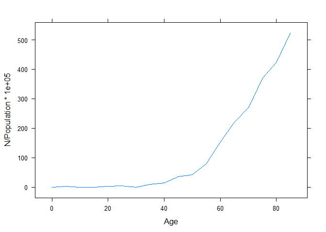

Itt most kézzel számoltuk ki az incidenciát, de elegánsabb (és a
későbbiekben jobban használható), ha ezt is az adatbázisban tesszük
meg. (Bár a `lattice` támogatja az egyszerű műveletek formulában történő
elvégzését – ezért működött az előbbi is – de erre jobb ha nem építünk,
mert bonyolultabb műveleteknél, pláne, ha adatbázist is manipulálni
kell, ez nem fog működni. A `data.table` azonban ilyenkor is használható
– épp ez az egyik fő előnye.) Jobb tehát, ha eleve is ezt szokjuk meg:

``` r
RawData[ Year==2015&County=="Budapest"&Sex=="Férfi"&ICDCode=="C18", .( Inc = N/Population*1e5, Age ) ]
```

    ##            Inc Age
    ##  1:   0.000000   0
    ##  2:   2.357184   5
    ##  3:   0.000000  10
    ##  4:   0.000000  15
    ##  5:   1.919828  20
    ##  6:   4.999792  25
    ##  7:   0.000000  30
    ##  8:   9.766817  35
    ##  9:  14.182084  40
    ## 10:  34.725839  45
    ## 11:  41.542136  50
    ## 12:  79.712151  55
    ## 13: 153.391240  60
    ## 14: 221.478724  65
    ## 15: 270.972112  70
    ## 16: 370.234939  75
    ## 17: 422.470130  80
    ## 18: 522.304992  85

Mivel most egyetlen sorig leszűkítettük (egy adott életkorra), így ez is
jó, de vegyük észre, hogy igazából arról van szó, hogy az életkor
szerint csoportosítunk:

``` r
RawData[ Year==2015&County=="Budapest"&Sex=="Férfi"&ICDCode=="C18",
         .( Inc = N/Population*1e5 ), .( Age ) ]
```

    ##     Age        Inc
    ##  1:   0   0.000000
    ##  2:   5   2.357184
    ##  3:  10   0.000000
    ##  4:  15   0.000000
    ##  5:  20   1.919828
    ##  6:  25   4.999792
    ##  7:  30   0.000000
    ##  8:  35   9.766817
    ##  9:  40  14.182084
    ## 10:  45  34.725839
    ## 11:  50  41.542136
    ## 12:  55  79.712151
    ## 13:  60 153.391240
    ## 14:  65 221.478724
    ## 15:  70 270.972112
    ## 16:  75 370.234939
    ## 17:  80 422.470130
    ## 18:  85 522.304992

A későbbiek szempontjából jobb ezt megjegyezni, hiszen ha nem minden
változó szerint szűkítünk, akkor csak ez fog működni.

Természetesen az ábrázolás ugyanaz, mint a legelső esetben is volt:

``` r
xyplot( Inc ~ Age,
        data = RawData[ Year==2015&County=="Budapest"&Sex=="Férfi"&ICDCode=="C18",
                        .( Inc = N/Population*1e5 ), .( Age ) ],
        type = "l" )
```

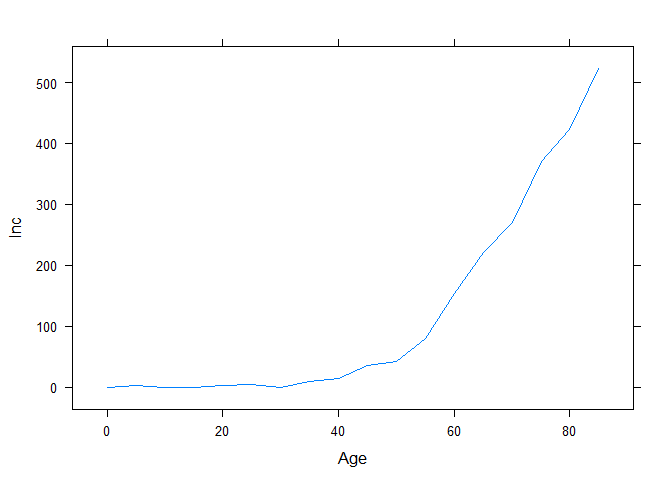

## Dimenziótól megszabadulás aggregálással

A második lehetőség, hogy egy dimenziót megtartunk összes értékével, de
az ezeket az értékeket aggregáljuk, például összegezzük.

Most a négy dimenzióból csak hármat szűkítsünk, a megyét nem: afölött
aggregálunk. A megoldás nagyon könnyű, egész egyszerűen ki kell hagynunk
a megyét a szűkítések felsorolásából. Természetesen ne felejtsük el,
hogy így már az esetszámot és a lélekszámot szummáznunk kell, hiszen
minden életkori résztáblában 20 sor lesz (az összes megye):

``` r
RawData[ Year==2015&Sex=="Férfi"&ICDCode=="C18", .( Inc = sum( N )/sum( Population )*1e5 ), .( Age ) ]
```

    ##     Age         Inc
    ##  1:   0   0.0000000
    ##  2:   5   0.3971990
    ##  3:  10   0.0000000
    ##  4:  15   0.3786896
    ##  5:  20   1.5703419
    ##  6:  25   2.8438086
    ##  7:  30   3.1123754
    ##  8:  35   6.7913774
    ##  9:  40  11.0429133
    ## 10:  45  22.1612141
    ## 11:  50  46.8615761
    ## 12:  55  85.6118403
    ## 13:  60 142.3670377
    ## 14:  65 238.1840322
    ## 15:  70 317.8261131
    ## 16:  75 409.3453023
    ## 17:  80 422.9426434
    ## 18:  85 424.2411821

(Év, nem és daganattípus szerint szűkítettünk, így ezek eleve
rögzítettek, majd pedig életkor szerint képeztünk résztáblákat, így az
egyes résztáblákban az is le lesz rögzítve, ezért lesz 20 sor
mindegyikben – hiszen már csak a megye maradt lerögzítetlen. Az
összegzés tehát ezen 20 megye adatainak összeadását jelenti.)

És persze nehogy `sum( N/Population )`-t írjunk, hiszen \(1/2+1/3\)
nagyon nem ugyanaz mint \(2/5\).

Ezt ábrázolva hasonló eredményt kapunk, de immár az összes megyére
vonatkozik az eredmény:

``` r
xyplot( Inc ~ Age,
        data = RawData[ Year==2015&Sex=="Férfi"&ICDCode=="C18",
                        .( Inc = sum( N )/sum( Population )*1e5 ), .( Age ) ],
        type = "l" )
```

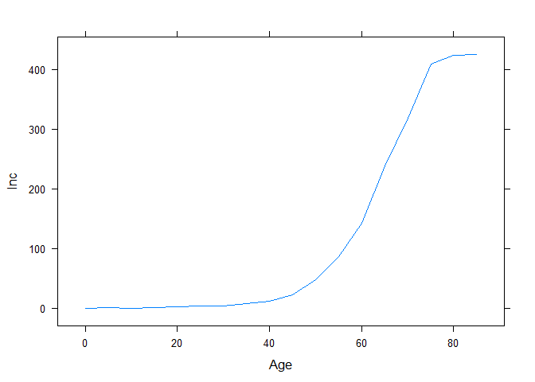

Természetesen nem muszáj csak egy dimenzió felett aggregálni. Mondjuk,
hogy nem csak az összes megyére, hanem mindkét nemre vonatkozó adatokat
szeretnénk, ez esetben egyetlen dolgunk van: a nemet is kihagyni a
szűkítések listájából. (Az összegzés már eleve ott van, legfeljebb
most nem 20, hanem 40 sor fog összeadódni.) A megoldás tehát:

``` r
xyplot( Inc ~ Age,
        data = RawData[ Year==2015&ICDCode=="C18",
                        .( Inc = sum( N )/sum( Population )*1e5 ), .( Age ) ],
        type = "l" )
```

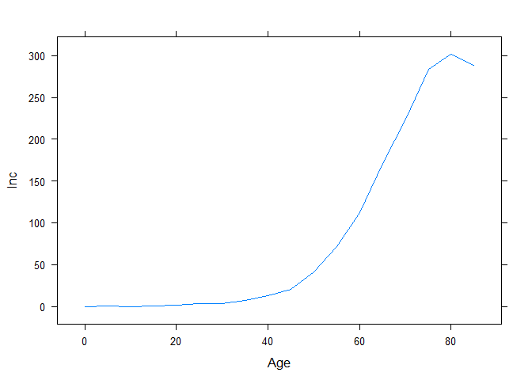

Az elv tehát nagyon egyszerű: ami szerint szeretnénk szűkíteni, azt
írjuk bele a szűkítési listába – amit pedig nem írunk bele, a fölött
automatikusan aggregálni fogunk. Csak ne felejtsük el a szummázást
kiírni, és életkor szerint csoportosítani.

## Dimenziótól megszabadulás külön ábrázolással

A harmadik lehetőség, hogy egy dimenziótól igazából nem szabadulunk meg,
csak külön ábrázoljuk. A példa kedvéért a nemet vizsgáljuk (a másik
három dimenziót továbbra is szűkítjük). Mivel igazából nem szabadulunk
meg, ezért a szerint is csoportosítanunk kell (természetesen az életkor
mellett, és természetesen továbbra is szummáznunk kell):

``` r
RawData[ ICDCode=="C18"&County=="Budapest"&Year==2015,
         .( Inc = sum( N )/sum( Population )*1e5 ), .( Age, Sex ) ]
```

    ##     Age   Sex        Inc
    ##  1:   0 Férfi   0.000000
    ##  2:   5 Férfi   2.357184
    ##  3:  10 Férfi   0.000000
    ##  4:  15 Férfi   0.000000
    ##  5:  20 Férfi   1.919828
    ##  6:  25 Férfi   4.999792
    ##  7:  30 Férfi   0.000000
    ##  8:  35 Férfi   9.766817
    ##  9:  40 Férfi  14.182084
    ## 10:  45 Férfi  34.725839
    ## 11:  50 Férfi  41.542136
    ## 12:  55 Férfi  79.712151
    ## 13:  60 Férfi 153.391240
    ## 14:  65 Férfi 221.478724
    ## 15:  70 Férfi 270.972112
    ## 16:  75 Férfi 370.234939
    ## 17:  80 Férfi 422.470130
    ## 18:  85 Férfi 522.304992
    ## 19:   0    Nő   0.000000
    ## 20:   5    Nő   0.000000
    ## 21:  10    Nő   0.000000
    ## 22:  15    Nő   0.000000
    ## 23:  20    Nő   1.886490
    ## 24:  25    Nő   4.772700
    ## 25:  30    Nő   4.302278
    ## 26:  35    Nő  10.680211
    ## 27:  40    Nő  15.239890
    ## 28:  45    Nő  19.884010
    ## 29:  50    Nő  28.990909
    ## 30:  55    Nő  59.194949
    ## 31:  60    Nő  89.025518
    ## 32:  65    Nő 123.464708
    ## 33:  70    Nő 148.529830
    ## 34:  75    Nő 282.907258
    ## 35:  80    Nő 274.666181
    ## 36:  85    Nő 349.342072
    ##     Age   Sex        Inc

De ne feledjük: így igazából nem szabadultunk meg a dimenziótól – tehát
ezt a függőben maradt dimenziót grafikus úton kell kezelnünk\! Ennek két
alapvető útja van.

### Külön ábrázolás egy ábrán, de más színnel

Az ábra marad ugyanaz, színnel különböztetjük meg a csoportokat (jelen
esetben nem szerinti csoportokat):

``` r
xyplot( Inc ~ Age, groups = Sex,
        data = RawData[ ICDCode=="C18"&County=="Budapest"&Year==2015,
                        .( Inc = sum( N )/sum( Population )*1e5 ),
                        .( Age, Sex ) ],
        type = "l", auto.key = list( columns = 2, points = FALSE, lines = TRUE ) )
```

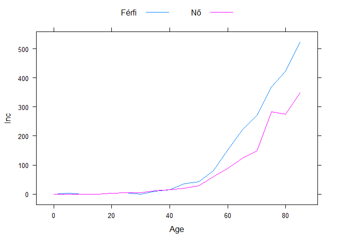

Általánosságban az mondható, hogy ez a módszer teszi a görbéket jobban
összehasonlíthatóvá, hiszen egymáson futnak (persze
megkülönböztethetően).

### Külön ábrázolás külön paneleken

A másik lehetőség, hogy kis részábrákat, paneleket alkalmazunk:

``` r
xyplot( Inc ~ Age | Sex,
        data = RawData[ ICDCode=="C18"&County=="Budapest"&Year==2015,
                        .( Inc = sum( N )/sum( Population )*1e5 ),
                        .( Age, Sex ) ],
        type = "l", layout = c( 2, 1 ) )
```

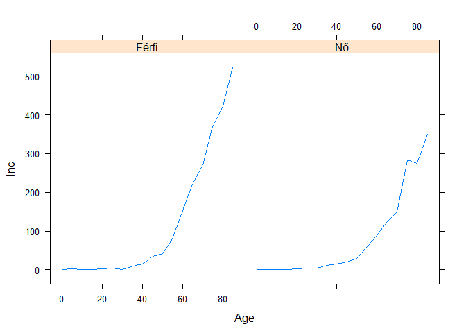

Itt az összevetés nehezebb, hiszen nem ugyanott vannak a görbék. De egy
dologra fontos emlékeznünk: ha az érdekel minket, hogy a görbe
balra-jobbra elmozdult-e, akkor érdemes az ábrákat egymás alá, ha az
érdekel, hogy fel-le elmozdult-e, akkor egymás mellé raknunk.

## A módszerek kombinálása

A dolog igazi erejét az adja, amikor a különböző módszereket
kombináljuk. Legyen mondjuk a cél a következő: diagnózis szerint
szűkítünk, megyéket aggregáljuk, az éveket külön paneleken, a nemeket
egy ábrán külön színekkel ábrázoljuk\!

Ez első hallásra kicsit ijesztően hangozhat, de valójában a világon
semmi bonyolultság nincs benne, egyszerűen kombinálni kell az eddig
látott megoldásokat:

``` r
xyplot( Inc ~ Age | factor( Year ), groups = Sex,
        data = RawData[ ICDCode=="C18", .( Inc = sum( N )/sum( Population )*1e5 ), .( Age, Sex, Year ) ],
        type = "l", auto.key = list( columns = 2, points = FALSE, lines = TRUE ), as.table = TRUE )
```

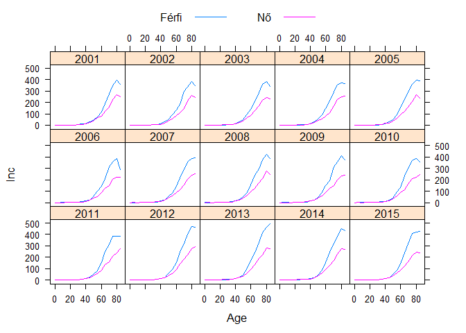

Fontos végiggondolni, hogy ez mit mutat meg jól\! Mivel a nemek vannak
különböző színnel ábrázolva, ezért azok vethetőek jól össze, az évek,
tehát az időbeli alakulás csak kevésbé.

Természetesen a dolog meg is fordítható:

``` r
xyplot( Inc ~ Age | Sex, groups = factor( Year ),
        data = RawData[ ICDCode=="C18", .( Inc = sum( N )/sum( Population )*1e5 ), .( Age, Sex, Year ) ],
        type = "l", auto.key = list( columns = 2, points = FALSE, lines = TRUE ), as.table = TRUE )
```

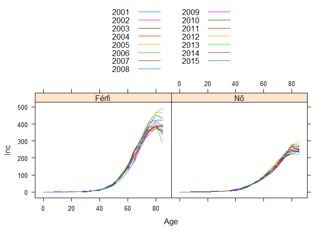

A probléma itt az, hogy a rengeteg szín miatt nehezen áttekinthető az
ábra (ennél kicsit több is igaz: mivel a `lattice` egy idő után elkezdi
reciklálni a színeket, így igazából nem is egyértelmű).

Gondoljuk meg, hol itt a probléma: az év az valójában *ordinális*
tulajdonság, de a fenti színezés ezt nem tükrözi (mondhatni:
*nominális*). Az ember e ponton megkérdezhetné, hogy mégis, hogyan
lehetne egy színezés ordinális?\! Például így:

``` r
xyplot( Inc ~ Age | Sex, groups = factor( Year ),
        data = RawData[ ICDCode=="C18", .( Inc = sum( N )/sum( Population )*1e5 ), .( Age, Sex, Year ) ],
        type = "l", auto.key = list( columns = 4, points = FALSE, lines = TRUE ), as.table = TRUE,
        par.settings = list( superpose.line = list(
                col = colorRampPalette( c( "green", "red" ) )( length( unique( RawData$Year ) ) ) ) ) )
```

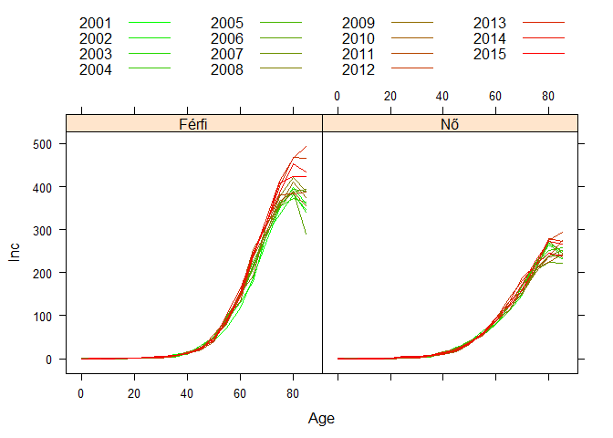

Lehet, hogy az egyes konkrét éveket továbbra is nehéz leolvasni, de az
*össztendencia* tökéletesen láthatóvá vált (férfiaknál romló helyzet
időben, nőknél nincs érdemi változás) annak ellenére is, hogy ilyen sok
görbe van az ábrán\! Mindössze azáltal, hogy ügyesen választottuk meg az
adatvizualizációt.

Visszatérve az eredeti gondolatra, láthatjuk, hogy minden dimenzióval
kezdeni kell valamit (szűkítés, aggregálás, külön ábrázolás más színnel,
külön ábrázolás más panelen), mivel pedig a dimenziók száma sem kevés,
jelen példában öt, ki lehet számolni, hogy hány lehetséges megoldás van…
Amit nagyon fontos érteni, hogy ezek mindegyike értelmes ábra, csak épp
az a kérdés, hogy mire. Fordítva elmondva: azt kell jól érteni, hogy az
egyes választások az adatok mely aspektusát teszik jól, jobban
láthatóvá\!

## További lehetőségek

További csomagokkal egyéb speciális lehetőségek is elérhetőek. Például
készítsük el az előbbi ábrát a `Hmisc` nevű csomaggal\! Látszólag nem
lesz nagy különbség, csak annyi történik, hogy az egyes görbék mellettük
lesznek feliratozva (sokan ezt is jobban szeretik, itt mondjuk nem
annyira számít, de ha kevés panel lenne, viszont egy panelen sok
különböző színű vonal, akkor sokkal inkább lenne jelentősége):

``` r
xYplot( Inc ~ Age | factor( Year ), groups = Sex,
        data = RawData[ ICDCode=="C18", .( Inc = sum( N )/sum( Population )*1e5 ), .( Age, Sex, Year ) ],
        type = "l", as.table = TRUE )
```

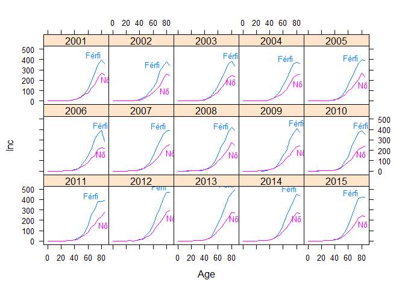

Az igazi ereje azonban az a csomagnak, hogy konfidenciaintervallumok
játszi könnyedséggel ábrázolhatóak. Ezek kiszámolása nem nehéz (egy
leszűkítettebb példán, hogy jobban áttekinthető legyen):

``` r
RawData[ Year==2015&County=="Budapest"&Sex=="Férfi"&ICDCode=="C18",
         with( binom.test( N, round( Population ) ),
               list( est = estimate, cilwr = conf.int[1], ciupr = conf.int[2] ) ),
         .( Age ) ]
```

    ##     Age          est        cilwr        ciupr
    ##  1:   0 0.000000e+00 0.000000e+00 8.441209e-05
    ##  2:   5 2.357156e-05 5.967801e-07 1.313253e-04
    ##  3:  10 0.000000e+00 0.000000e+00 1.050160e-04
    ##  4:  15 0.000000e+00 0.000000e+00 1.038950e-04
    ##  5:  20 1.919828e-05 4.860582e-07 1.069613e-04
    ##  6:  25 4.999833e-05 1.031098e-05 1.461093e-04
    ##  7:  30 0.000000e+00 0.000000e+00 5.510820e-05
    ##  8:  35 9.766817e-05 4.216710e-05 1.924361e-04
    ##  9:  40 1.418198e-04 6.801015e-05 2.607962e-04
    ## 10:  45 3.472584e-04 2.121269e-04 5.362617e-04
    ## 11:  50 4.154166e-04 2.462202e-04 6.564581e-04
    ## 12:  55 7.971303e-04 5.583608e-04 1.103395e-03
    ## 13:  60 1.533912e-03 1.221932e-03 1.901166e-03
    ## 14:  65 2.214787e-03 1.790133e-03 2.709667e-03
    ## 15:  70 2.709721e-03 2.195417e-03 3.308041e-03
    ## 16:  75 3.702349e-03 2.941254e-03 4.599612e-03
    ## 17:  80 4.224701e-03 3.255009e-03 5.391691e-03
    ## 18:  85 5.223050e-03 3.997505e-03 6.704237e-03

(Ne felejtsük el, hogy a `data.table`-ben a `.( )` szintaktika igazából
a `list`-et helyettesíti. Viszont mivel itt mi – a `with`-del – eleve
listát adunk vissza, így a külön `.( )`-re nincs szükség.)

Most terjesszük ki ezzel az előző ábrát:

``` r
xYplot( Cbind( est*1e5, cilwr*1e5, ciupr*1e5 ) ~ Age | factor( Year ), groups = Sex, ylab = "Inc",
        data = RawData[ ICDCode=="C18", with( binom.test( sum( N ), round( sum( Population ) ) ),
                                              list( est = estimate, cilwr = conf.int[1], ciupr = conf.int[2] ) ),
                        .( Age, Sex, Year ) ], type = "l", as.table = TRUE )
```

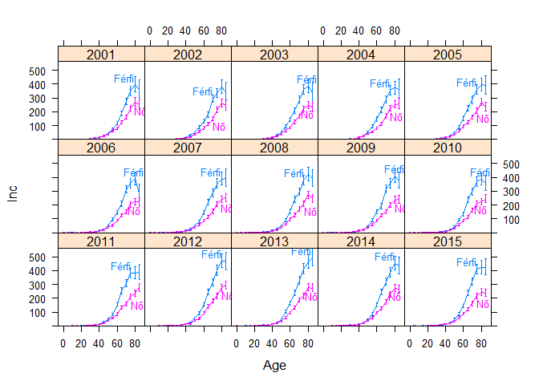

Eljutottunk oda, egyszerű lépések összerakásával, hogy ilyen ábrát már
igazán nem lenne könnyű más módon előállítani\! A dolog igazi ereje,
hogy mindezt 4 (\!) sorban, de ami még jobb, úgy, hogy a kód kis
gyakorlattal szinte kiolvasható mint egy angol mondat.

## Interaktívvá tétel webes felületen

A fenti megoldás inherens hátránya, hogy `R`-et igényel. A lefuttatása
feltétlenül, ha meg valamit módosítani kell (például másik ráktípusra
szeretnénk szűkíteni), akkor valamilyen szinten még módosítani is kell
tudni a kódot. Mennyivel jobb lenne egy olyan megoldás, mely `R` tudás
(és egyáltalán, telepített `R`) nélkül is használható, és kényelmesen
kezelhető\!

Erre kínál megoldást a `shiny` csomag. Sőt, ennél többre is, ezzel
ugyanis a webre tehetjük ki a megoldásunkat, jól kezelhető webes
felülettel, mely egyrészt semmilyen `R` tudást nem igényel, másrészt
nagyon kényelmessé teszi az ábrázolás testreszabását (például a
szűkítések átállítását). Az egészben az a jó, hogy webes felület
kialakítása *maga* sem igényel semmilyen webes tudást, tisztán `R`-ben
elintézhető\!

Minderre mutat példát a <https://research.physcon.uni-obuda.hu/> címen
elérhető ‘Rákregiszter vizualizátor’ alkalmazás.

Érdemes megjegyezni, hogy ennek *teljes* kódja (beleértve a webes
interfész kialakítását *és* az összes ábrázolási lehetőség összes
kódját, többféle grafikontól a térképen át a regressziós modellezésig)
nincs 450 sor\!
